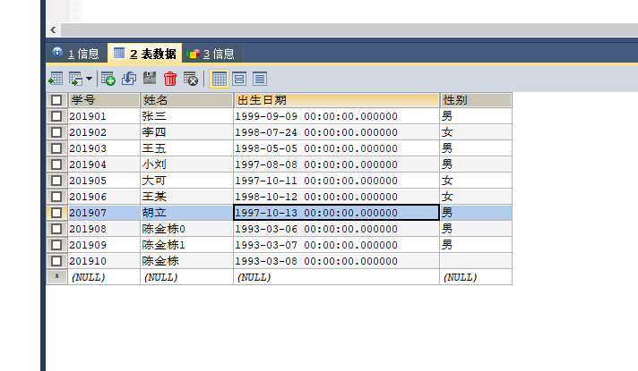
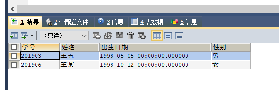
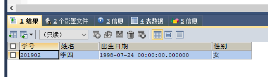
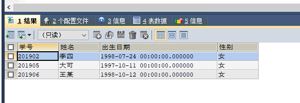
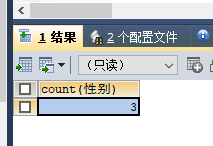
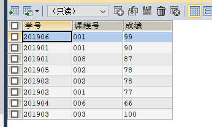
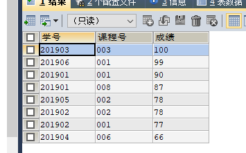
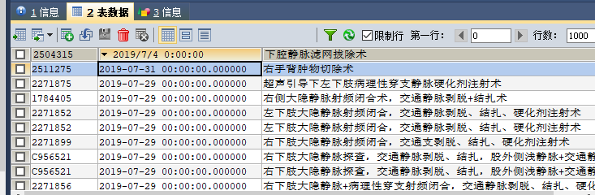
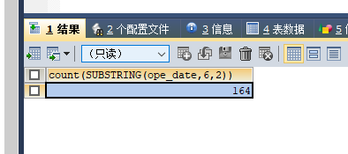

### 导入表
> 手动导入
### 重命名表
```
ALTER  TABLE student RENAME TO cjd_student
```
### 删除表
```
DROP TABLE table_name
```
## 练习
1. 向student表中插入3个学生的信息，要求其中1个学生没有性别
```
INSERT INTO cjd_student (学号, 姓名,出生日期, 性别) VALUES ('201908','陈金栋0','1993-03-06 00:00:00.000000','男'),
('201909','陈金栋1','1993-03-07 00:00:00.000000','男'),
('201910','陈金栋','1993-03-08 00:00:00.000000','');
```

出现过错误
```
INSERT INTO cjd_student ('学号', '姓名','出生日期', '性别') VALUES ('201908','陈金栋0','1993-03-06 00:00:00.000000','男'),
('201909','陈金栋1','1993-03-07 00:00:00.000000','男'),
('201910','陈金栋','1993-03-08 00:00:00.000000','');
```
> 列名不要加引号，正常情况下列名都是英文
2. 查询姓王的学生名单
```
SELECT * FROM cjd_student WHERE 姓名 LIKE '王%'
```

3. 查询含李的学生名单
```
SELECT * FROM cjd_student WHERE 姓名 LIKE '%李%'
```

4. 查询所有学生的学号、姓名、选课数、总成绩
5. 查询男生、女生的人数
> 女生的数据
```
SELECT * FROM cjd_student WHERE 性别='女'
```

> 女生的数量
```
SELECT COUNT(性别) FROM cjd_student WHERE 性别='女'
```

- 将中文字段名改成英文的
```
ALTER TABLE cjd_student CHANGE COLUMN 性别 stu_sex VARCHAR(5)
```

6. 查询不及格的课程并按课程号从大到小排列
>  ```AS res```在对上次执行结果再次操作时
```
SELECT * FROM (SELECT * FROM cjd_score WHERE 成绩 >= 60) AS res ORDER BY 成绩 DESC
```

> 其中100排在最后，这是因为 成绩 是 string 型，但存的是数值。```字段名上+0```
```
SELECT * FROM (SELECT * FROM cjd_score WHERE 成绩 >= 60) AS res ORDER BY 成绩+0 DESC
```

7. 计算7月份每天的手术量
> 初始数据

- 先改个列名
```
SELECT COUNT(SUBSTRING(ope_date,6,2)) FROM cjd_operation WHERE SUBSTRING(ope_date,6,2)='07'
```

8. 在disease_course表中查询术前平均住院日(按天计算)
手术时间-入院时间=术前住院时间，所有术前住院时间总和/人数(注：手术时间要对应上入院时间)