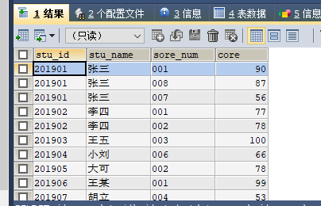

### MySQL数据库
#### SQL语句
##### SELECT
> 查询数据
```
SELECT column_name,column_name FROM table_name
```
- 查询语句中你可以使用一个或者多个表，表之间使用逗号(,)分割，并使用WHERE语句来设定查询条件。
- SELECT 命令可以读取一条或者多条记录。
- 你可以使用星号（*）来代替其他字段，SELECT语句会返回表的所有字段数据
- 你可以使用 WHERE 语句来包含任何条件。
- 你可以使用 LIMIT 属性来设定返回的记录数。
##### WHERE
> 在 MySQL 数据表中读取指定的数据(使用主键来作为 WHERE 子句的条件查询是非常快速的)。
```
SELECT * from runoob_tbl  WHERE runoob_author LIKE '%COM'
```
- 你可以在 WHERE 子句中指定任何条件。
- 你可以使用 AND 或者 OR 指定一个或多个条件。
- WHERE 子句也可以运用于 SQL 的 DELETE 或者 UPDATE 命令。
- WHERE 子句类似于程序语言中的 if 条件，根据 MySQL 表中的字段值来读取指定的数据。
##### UPDATE
> 修改或更新 MySQL 中的数据
```
UPDATE table_name SET field1=new-value1, field2=new-value2
[WHERE Clause]
```
- 你可以同时更新一个或多个字段。
- 你可以在 WHERE 子句中指定任何条件。
- 你可以在一个单独表中同时更新数据。
##### DELETE
```
DELETE FROM table_name [WHERE Clause]
```
- 如果没有指定 WHERE 子句，MySQL 表中的所有记录将被删除。
- 你可以在 WHERE 子句中指定任何条件
- 您可以在单个表中一次性删除记录。
##### LIKE
> 使用百分号 %字符来表示任意字符,如果没有使用百分号 %, LIKE 子句与等号 = 的效果是一样的。
```
SELECT field1, field2,...fieldN 
FROM table_name
WHERE field1 LIKE condition1 [AND [OR]] filed2 = 'somevalue'
```
- 你可以在 WHERE 子句中指定任何条件。
- 你可以在 WHERE 子句中使用LIKE子句。
- 你可以使用LIKE子句代替等号 =。
- LIKE 通常与 % 一同使用，类似于一个元字符的搜索。
- 你可以使用 AND 或者 OR 指定一个或多个条件。
- 你可以在 DELETE 或 UPDATE 命令中使用 WHERE...LIKE 子句来指定条件。
##### UNION
> MySQL UNION 操作符用于连接两个以上的 SELECT 语句的结果组合到一个结果集合中。多个 SELECT 语句会删除重复的数据。
```
SELECT expression1, expression2, ... expression_n
FROM tables
[WHERE conditions]
UNION [ALL | DISTINCT]
SELECT expression1, expression2, ... expression_n
FROM tables
[WHERE conditions];
```
- expression1, expression2, ... expression_n: 要检索的列。
- tables: 要检索的数据表。
- WHERE conditions: 可选， 检索条件。
- DISTINCT: 可选，删除结果集中重复的数据。默认情况下 UNION 操作符已经删除了重复数据，所以 DISTINCT 修饰符对结果没啥影响。
- ALL: 可选，返回所有结果集，包含重复数据。
##### 排序
> 使用 MySQL 的 ORDER BY 子句来设定你想按哪个字段哪种方式来进行排序，再返回搜索结果。
```
SELECT field1, field2,...fieldN FROM table_name1, table_name2...
ORDER BY field1 [ASC [DESC][默认 ASC]], [field2...] [ASC [DESC][默认 ASC]]
```
- 你可以使用任何字段来作为排序的条件，从而返回排序后的查询结果。
- 你可以设定多个字段来排序。
- 你可以使用 ASC 或 DESC 关键字来设置查询结果是按升序或降序排列。 默认情况下，它是按升序排列。
- 你可以添加 WHERE...LIKE 子句来设置条件。
##### GROUP BY
> GROUP BY 语句根据一个或多个列对结果集进行分组。在分组的列上我们可以使用 COUNT, SUM, AVG,等函数。
```
SELECT name, COUNT(*) FROM   employee_tbl GROUP BY name
```
##### ALTER
> 修改数据表名或者修改数据表字段
```
ALTER TABLE testalter_tbl  DROP i
```
```
ALTER TABLE testalter_tbl ADD i INT
```
##### 重命名表
```
ALTER  TABLE student RENAME TO cjd_student
```
##### 删除表
```
DROP TABLE table_name
```
##### JOIN
> 
```
SELECT a.runoob_id, a.runoob_author, b.runoob_count FROM runoob_tbl a INNER JOIN tcount_tbl b ON a.runoob_author = b.runoob_author;
```
等同于
```
SELECT a.runoob_id, a.runoob_author, b.runoob_count FROM runoob_tbl a, tcount_tbl b WHERE a.runoob_author = b.runoob_author;
```
- INNER JOIN（内连接,或等值连接）：获取两个表中字段匹配关系的记录。
- LEFT JOIN（左连接）：获取左表所有记录，即使右表没有对应匹配的记录。
- RIGHT JOIN（右连接）： 与 LEFT JOIN 相反，用于获取右表所有记录，即使左表没有对应匹配的记录。
## 练习
1. 向student表中插入3个学生的信息，要求其中1个学生没有性别
```
INSERT INTO cjd_student (学号, 姓名,出生日期, 性别) VALUES ('201908','陈金栋0','1993-03-06 00:00:00.000000','男'),
('201909','陈金栋1','1993-03-07 00:00:00.000000','男'),
('201910','陈金栋','1993-03-08 00:00:00.000000','');
```

出现过错误
```
INSERT INTO cjd_student ('学号', '姓名','出生日期', '性别') VALUES ('201908','陈金栋0','1993-03-06 00:00:00.000000','男'),
('201909','陈金栋1','1993-03-07 00:00:00.000000','男'),
('201910','陈金栋','1993-03-08 00:00:00.000000','');
```
> 列名不要加引号，正常情况下列名都是英文

2. 查询姓王的学生名单
```
SELECT * FROM cjd_student WHERE 姓名 LIKE '王%'
```


3. 查询含李的学生名单
```
SELECT * FROM cjd_student WHERE 姓名 LIKE '%李%'
```


4. 查询所有学生的学号、姓名、选课数、总成绩
```
SELECT cjd_score.`stu_id`,cjd_student.`stu_name`,cjd_score.`sore_num`,cjd_score.`core` 
FROM cjd_score
INNER JOIN cjd_student
ON cjd_score.stu_id=cjd_student.stu_id;
```


5. 查询男生、女生的人数
> 女生的数据
```
SELECT * FROM cjd_student WHERE 性别='女'
```

> 女生的数量
```
SELECT COUNT(性别) FROM cjd_student WHERE 性别='女'
```

- 将中文字段名改成英文的
```
ALTER TABLE cjd_student CHANGE COLUMN 性别 stu_sex VARCHAR(5)
```


6. 查询不及格的课程并按课程号从大到小排列
>  ```AS res```在对上次执行结果再次操作时
```
SELECT * FROM (SELECT * FROM cjd_score WHERE 成绩 >= 60) AS res ORDER BY 成绩 DESC
```

> 其中100排在最后，这是因为 成绩 是 string 型，但存的是数值。```字段名上+0```
```
SELECT * FROM (SELECT * FROM cjd_score WHERE 成绩 >= 60) AS res ORDER BY 成绩+0 DESC
```


7. 计算7月份每天的手术量
> 初始数据

- 先改个列名
```
SELECT COUNT(SUBSTRING(ope_date,6,2)) FROM cjd_operation WHERE SUBSTRING(ope_date,6,2)='07'
```


8. 在disease_course表中查询术前平均住院日(按天计算)
手术时间-入院时间=术前住院时间，所有术前住院时间总和/人数(注：手术时间要对应上入院时间)